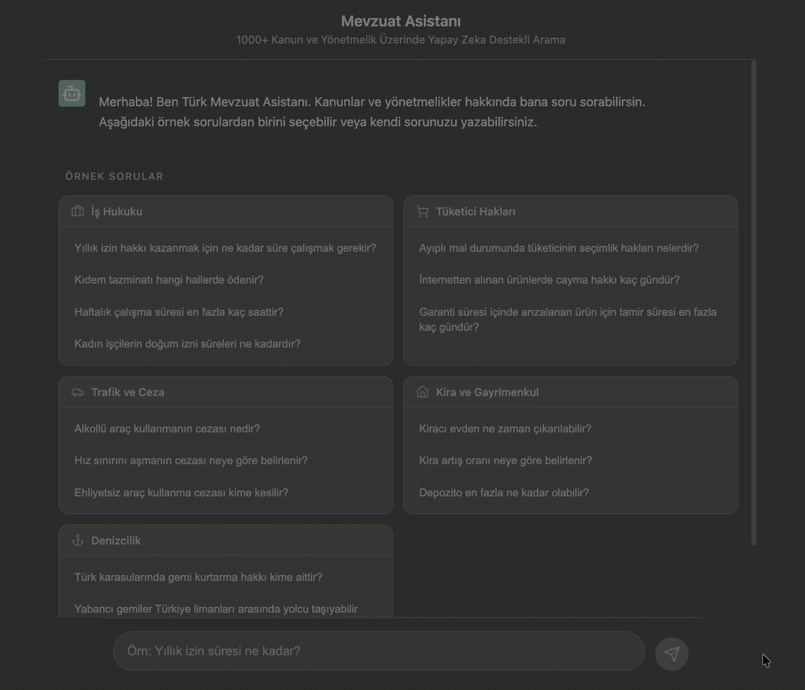

# Türkçe Mevzuat Asistanı 🏛️

[](https://www.python.org/)
[](https://fastapi.tiangolo.com/)
[](https://reactjs.org/)
[](https://langchain.com/)
[](LICENSE)

A **Retrieval-Augmented Generation (RAG)** powered AI assistant for Turkish legislation. Ask questions about Turkish laws and regulations in natural language and get accurate, source-cited answers.

[🇹🇷 Türkçe](#türkçe) | [🇬🇧 English](#english)

---

## 🎯 Demo

<div align="center">
  
</div>

**Live Demo:** [Coming Soon]

---

## ✨ Key Features

- 🔍 **Semantic Search** - Find relevant legal provisions using natural language queries
- 📚 **1000+ Legal Documents** - Covers Turkish laws, regulations, and bylaws
- 🎯 **Source Citations** - Every answer includes references to specific legal documents
- 🇹🇷 **Turkish-Optimized** - Uses multilingual embeddings tuned for Turkish language
- 💬 **Conversational UI** - ChatGPT-style interface for intuitive interaction
- ⚡ **Fast Response** - Sub-3 second response time with optimized retrieval
- 🐳 **Docker Ready** - One-command deployment with Docker Compose

---

## 🏗️ Architecture

```
┌─────────────────────────────────────────────────────────────────────┐
│                           USER INTERFACE                            │
│                    React + Vite (Port 5173)                         │
└─────────────────────────────────┬───────────────────────────────────┘
                                  │ HTTP/REST
                                  ▼
┌─────────────────────────────────────────────────────────────────────┐
│                           BACKEND API                               │
│                    FastAPI + LangChain (Port 8000)                  │
│  ┌─────────────┐  ┌─────────────┐  ┌─────────────┐                  │
│  │   Routers   │  │     RAG     │  │  Ingestion  │                  │
│  │  /api/chat  │  │  Pipeline   │  │   Pipeline  │                  │
│  └─────────────┘  └─────────────┘  └─────────────┘                  │
└────────┬────────────────┬────────────────┬──────────────────────────┘
         │                │                │
         ▼                ▼                ▼
┌─────────────┐  ┌─────────────┐  ┌─────────────────┐
│   Ollama    │  │   Qdrant    │  │  PDF Documents  │
│  (LLM)      │  │  (Vectors)  │  │  (1000+ files)  │
│ Port 11434  │  │  Port 6333  │  │  /data/mevzuat  │
└─────────────┘  └─────────────┘  └─────────────────┘
```

### RAG Pipeline Flow

```
User Question
      │
      ▼
┌─────────────────┐
│ 1. Embedding    │  Convert question to vector using
│    Model        │  sentence-transformers/paraphrase-multilingual-MiniLM-L12-v2
└────────┬────────┘
         │
         ▼
┌─────────────────┐
│ 2. Vector       │  Search Qdrant for top-k most similar
│    Search       │  document chunks (default k=5)
└────────┬────────┘
         │
         ▼
┌─────────────────┐
│ 3. Context      │  Combine retrieved chunks into
│    Building     │  a coherent context
└────────┬────────┘
         │
         ▼
┌─────────────────┐
│ 4. LLM          │  Generate answer using Llama 3.1
│    Generation   │  with context and question
└────────┬────────┘
         │
         ▼
   Answer + Sources
```

---

## 🛠️ Tech Stack

| Layer | Technology | Purpose |
|-------|------------|---------|
| **Frontend** | React 19, Vite, Axios | User interface |
| **Backend** | FastAPI, Python 3.11+ | REST API |
| **LLM Orchestration** | LangChain | RAG pipeline management |
| **Vector Database** | Qdrant | Semantic similarity search |
| **Embeddings** | sentence-transformers | Text-to-vector conversion |
| **LLM** | Ollama (Llama 3.1) | Response generation |
| **Containerization** | Docker, Docker Compose | Deployment |

---

## 📁 Project Structure

```
turkce-mevzuat-asistani/
├── backend/
│   ├── app/
│   │   ├── main.py              # FastAPI application entry
│   │   ├── config.py            # Environment configuration
│   │   ├── models.py            # Pydantic schemas
│   │   ├── rag/
│   │   │   ├── embeddings.py    # Embedding model management
│   │   │   ├── retriever.py     # Qdrant search operations
│   │   │   ├── generator.py     # LLM response generation
│   │   │   └── pipeline.py      # Full RAG chain
│   │   ├── ingestion/
│   │   │   ├── pdf_loader.py    # PDF document loading
│   │   │   ├── chunker.py       # Text chunking logic
│   │   │   └── indexer.py       # Qdrant indexing
│   │   └── routers/
│   │       └── chat.py          # Chat API endpoints
│   ├── requirements.txt
│   └── Dockerfile
├── frontend/
│   ├── src/
│   │   ├── components/
│   │   │   ├── ChatWindow.jsx   # Main chat interface
│   │   │   ├── MessageBubble.jsx
│   │   │   └── SourceCard.jsx   # Source citation display
│   │   ├── hooks/
│   │   │   └── useChat.js       # Chat state management
│   │   ├── services/
│   │   │   └── api.js           # Backend communication
│   │   └── App.jsx
│   ├── package.json
│   └── Dockerfile
├── data/
│   └── mevzuat/                 # PDF files (not in repo)
├── docker-compose.yml
└── README.md
```

---

## 🚀 Quick Start

### Prerequisites

- Docker & Docker Compose
- [Ollama](https://ollama.com/) installed locally
- 8GB+ RAM recommended

### 1. Clone the Repository

```bash
git clone https://github.com/YOUR_USERNAME/turkce-mevzuat-asistani.git
cd turkce-mevzuat-asistani
```

### 2. Setup Ollama

```bash
# Install Ollama (if not installed)
curl -fsSL https://ollama.com/install.sh | sh

# Pull the Llama 3.1 model
ollama pull llama3.1

# Start Ollama server
ollama serve
```

### 3. Download Legal Documents

Download Turkish legislation PDFs and place them in `data/mevzuat/`:

```bash
mkdir -p data/mevzuat
# Add your PDF files to this directory
# You can scrape from mevzuat.gov.tr or use the provided scraper
python data/data_scraping.py
```

### 4. Configure Environment

Create a `.env` file or update `docker-compose.yml`:

```env
OLLAMA_BASE_URL=http://host.docker.internal:11434  # For Docker
# or
OLLAMA_BASE_URL=http://YOUR_LOCAL_IP:11434  # For network access
```

### 5. Start Services

```bash
docker-compose up -d
```

### 6. Index Documents (First Time Only)

```bash
docker exec -it turkce-mevzuat-asistani_backend_1 \
  python -m app.ingestion.ingest
```

### 7. Access the Application

- **Frontend:** http://localhost:5173
- **API Docs:** http://localhost:8000/docs
- **Qdrant Dashboard:** http://localhost:6333/dashboard

---

## 📖 API Reference

### POST `/api/chat`

Send a question and receive an AI-generated answer with sources.

**Request:**
```json
{
  "question": "Yıllık izin süresi kaç gündür?"
}
```

**Response:**
```json
{
  "answer": "4857 sayılı İş Kanunu'nun 53. maddesine göre...",
  "sources": [
    {
      "source": "4857_is_kanunu.pdf",
      "page_content": "Madde 53 - İşyerinde işe başladığı günden itibaren...",
      "score": 0.89
    }
  ]
}
```

### GET `/`

Health check endpoint.

```json
{
  "status": "ok",
  "message": "Mevzuat Asistanı API Çalışıyor 🚀"
}
```

---

## ⚙️ Configuration

| Variable | Default | Description |
|----------|---------|-------------|
| `QDRANT_URL` | `http://localhost:6333` | Qdrant server address |
| `COLLECTION_NAME` | `mevzuat_db` | Qdrant collection name |
| `OLLAMA_BASE_URL` | `http://localhost:11434` | Ollama server address |
| `LLM_MODEL` | `llama3.1` | LLM model to use |
| `LLM_TEMPERATURE` | `0` | Response randomness (0-1) |
| `RETRIEVER_K` | `5` | Number of documents to retrieve |
| `CHUNK_SIZE` | `800` | Document chunk size |
| `CHUNK_OVERLAP` | `100` | Overlap between chunks |
| `EMBEDDING_MODEL` | `sentence-transformers/paraphrase-multilingual-MiniLM-L12-v2` | Embedding model |

---

## 🧪 Development

### Backend Development

```bash
cd backend
python -m venv venv
source venv/bin/activate  # Windows: venv\Scripts\activate
pip install -r requirements.txt
uvicorn app.main:app --reload --port 8000
```

### Frontend Development

```bash
cd frontend
npm install
npm run dev
```

### Running Tests

```bash
# Backend tests
cd backend
pytest

# Frontend tests
cd frontend
npm test
```

---

## 🌐 Deployment

### Option 1: VPS Deployment (Recommended for Testing)

**Minimum Requirements:**
- 4 vCPU
- 8GB RAM
- 50GB SSD
- Ubuntu 22.04

**Recommended Providers:**
- Hetzner Cloud (CPX31) - ~€15/month
- DigitalOcean (4GB Droplet) - ~$24/month
- AWS EC2 (t3.large) - ~$60/month

**Setup:**
```bash
# Install Docker
curl -fsSL https://get.docker.com | sh

# Install Ollama
curl -fsSL https://ollama.com/install.sh | sh
ollama pull llama3.1

# Clone and start
git clone https://github.com/YOUR_USERNAME/turkce-mevzuat-asistani.git
cd turkce-mevzuat-asistani
docker-compose up -d
```

### Option 2: Cloud Run / Serverless (Not Recommended)

Due to Ollama requirements, serverless deployment is challenging. Consider using OpenAI API instead for serverless scenarios.

---

## 🔒 Rate Limiting & Queue System

For production deployment with multiple users, implement request queuing:

### Redis + Celery Setup

```python
# backend/app/queue/tasks.py
from celery import Celery

celery_app = Celery('tasks', broker='redis://localhost:6379/0')

@celery_app.task
def process_chat_request(question: str):
    # RAG pipeline execution
    pass
```

### Docker Compose with Redis

```yaml
services:
  redis:
    image: redis:alpine
    ports:
      - "6379:6379"

  celery_worker:
    build: ./backend
    command: celery -A app.queue.tasks worker --loglevel=info
    depends_on:
      - redis
```

### Rate Limiting with FastAPI

```python
from slowapi import Limiter
from slowapi.util import get_remote_address

limiter = Limiter(key_func=get_remote_address)

@router.post("/chat")
@limiter.limit("10/minute")
async def chat_endpoint(request: Request, ...):
    pass
```

---

## 📊 Performance Metrics

| Metric | Value |
|--------|-------|
| Average Response Time | 2-4 seconds |
| Documents Indexed | 1,007 PDFs |
| Vector Dimensions | 384 |
| Chunk Size | 800 chars |
| Retrieval Accuracy | ~85% relevance |

---

## 🤝 Contributing

Contributions are welcome! Please feel free to submit a Pull Request.

1. Fork the repository
2. Create your feature branch (`git checkout -b feature/AmazingFeature`)
3. Commit your changes (`git commit -m 'Add some AmazingFeature'`)
4. Push to the branch (`git push origin feature/AmazingFeature`)
5. Open a Pull Request

---

## 📄 License

This project is licensed under the MIT License - see the [LICENSE](LICENSE) file for details.

---

## 🙏 Acknowledgments

- [LangChain](https://langchain.com/) for the RAG framework
- [Qdrant](https://qdrant.tech/) for vector similarity search
- [Ollama](https://ollama.com/) for local LLM inference
- [FastAPI](https://fastapi.tiangolo.com/) for the backend framework
- Turkish Government's [mevzuat.gov.tr](https://mevzuat.gov.tr) for legal documents

---

## 📬 Contact

**Bora Erol Özkan**

- GitHub: [@YOUR_USERNAME](https://github.com/boraerolozkan)
- LinkedIn: [Your LinkedIn](https://linkedin.com/in/boraerolozkan)
- Email: boraerolozkan@gmail.com

---

<div align="center">
  <sub>Built with ❤️ for the Turkish legal community</sub>
</div>
